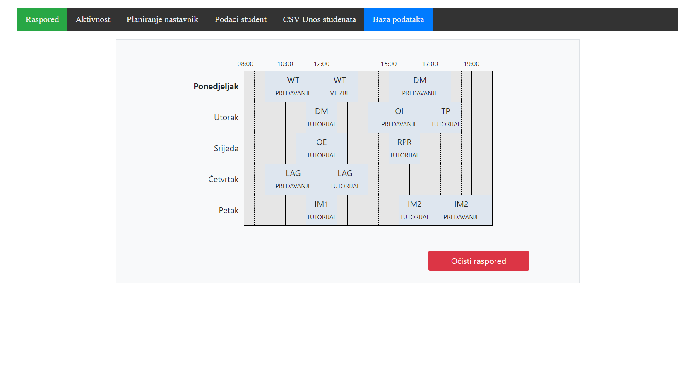

<!-- PROJECT LOGO -->
 

  

  <h3 align="center">Schedule Planning</h3>

<!-- ABOUT THE PROJECTt --> 
## About The Project

Website mainly focused on Javascript and CSS skills as well as backend development, done for faculty project on Web Technologies course.

Javascript contains dynamically drawing week schedule for faculty courses and obligations helped by CSS classes and properties.

In addition, we have activities tab where we can see our dynamically activities depending on actual date i.e. actual day of the week. 

Professor can input new activity or student to be stored in MySQL database. Entered data automatically reflects in the schedule and activities tab, as we said.   

A simple frontend implementation, with the help of Bootstrap, provides data nicely structured into schedule and tables for database tab.

The project also contains tests. They are executed with Chai and Mocha packages that read tests in CSV format, parse into pure JS objects and then do their purpose.  
### Built With

This section is list of languages and frameworks that project uses:
* [JavaScript]()
* [NodeJS]()
    * [ExpressJS]()
    * [Sequelize]()
    * [Chai & Mocha]()
* [Bootstrap]()
* [HTML]()
* [CSS]()
* [MySQL]()
    